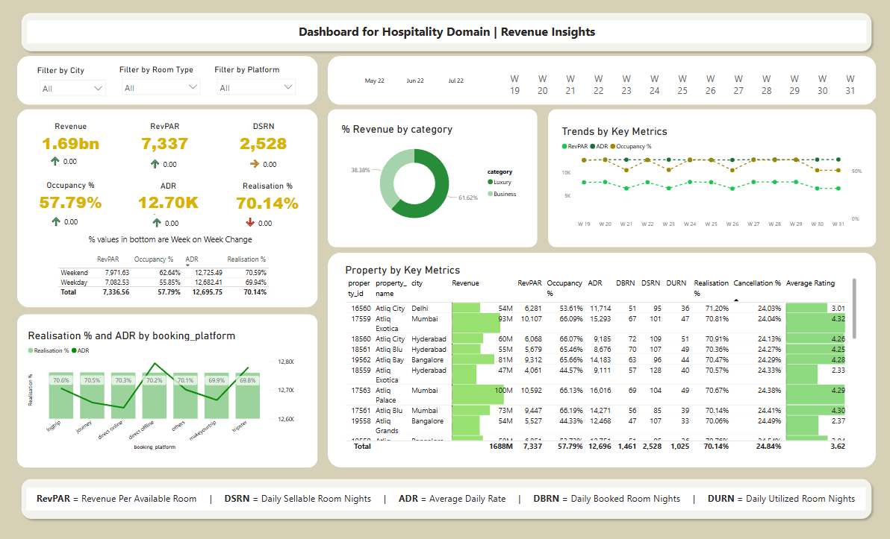
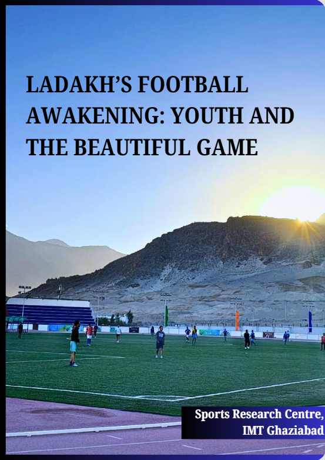

# 📊 Vinay Rawat – Data and Research Analyst Portfolio

Welcome to my portfolio showcasing a powerful blend of data analytics and research expertise.  
I work at the intersection of business intelligence, public policy, and sports research — delivering insights through dashboards, reports, and strategic studies.

---

## 📁 Power BI Dashboards

### 1. **Revenue Insights in Hospitality Domain**

📌 **Description**:  

This dashboard provides a comprehensive overview of sales performance across different regions, product categories, and time periods. It allows decision-makers to track key metrics such as revenue, profit, and quantity sold, helping them identify top-performing areas and optimize strategy accordingly.

🔧 **Skills Used**:  

Power BI | DAX | Time Intelligence | Slicers & Filters | Data Modeling

🔗 **Download Report**: [Hospitality_Domain_Dashboard.pbix](Hospitality_Domain_Dashboard.pbix)

---
## 📄 Research & Reports

### 1. 🏏 Sports Manufacturing Policy Report – FICCI & IMT Ghaziabad  

📌 **Description**:  
Co-authored a whitepaper addressing India's sports manufacturing sector challenges. Provided analysis on export hurdles, policy gaps, and recommended regulatory improvements.  
🔗 **Link**: [View Report]([https://www.linkedin.com/posts/ficci_ficci-imtg-whitepaper-ugcPost-7331213629024862208-QD4u](https://ficci.in/study_details/24101))  
🔧 **Skills Used**:  

Policy Research | Industry Analysis | Secondary Data | Report Writing

---

### 2. 🏔️ Ladakh: Football Awakening – Regional Socioeconomic Analysis  

📌 **Description**:  
This report explores how football is emerging as a vehicle for youth empowerment and community development in Ladakh. It examines the region’s socio-economic landscape, football ecosystem, and the transformative role of sports in isolated geographies.

🔗 **Link**: [Read More](http://web.imt.edu/downloadfiles/src/Ladakh-Football-Awakening/)

🔧 **Skills Used**:  

Data Collection | Regional Economics | Insight Synthesis | Visualization (Excel)

---

### 3. 📈 Raising The Score – Performance Analytics in Sports  

_page-0001.jpg)

📌 **Description**:  
Worked on identifying key performance indicators in sports and how analytics can be used to enhance athlete/team results.  
🔗 **Link**: [Read More](http://web.imt.edu/downloadfiles/src/Raising-the-Score.pdf)  
🔧 **Skills Used**:  

Performance Metrics | Data Analytics | Research Writing

---

## 📫 Let's Connect

💼 **LinkedIn**: [linkedin.com/in/vinay-rawat-455b721ba](https://www.linkedin.com/in/vinay-rawat-455b721ba/)  
📂 **GitHub**: [github.com/Vinayrawat12](https://github.com/Vinayrawat12)

---

> “Without data, you're just another person with an opinion.” – W. Edwards Deming

